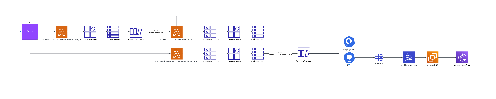

# Chat-Stat
A Twitch emote metric tracking app

## :construction: Project State :construction:

:rotating_light: THE CURRENT STATUS OF THIS PROJECT IS SUSPENDED :rotating_light:  

I ran into issues with Twitch's api that would not allow me to automate clip
generation after a live stream ended. There is an unsupported GQL api but I was not able to reverse 
engineer the [authentication method that Twitch is using](https://github.com/streamlink/streamlink/issues/5370). This was a major feature of the project and has caused me 
to re-evaluate what I want to do with this project. Notably I also used this project to learn 
kubernetes, and since the workflow of automating clips, downloading the clip, programatically 
editing clips together, and then uploading those videos to Youtube is not possible at this time I have decided to 
[decomission my kubernetes cluster](https://github.com/Fomiller/aws-infrastructure/tree/develop/infra/modules/aws/eks) 
for the time being. The cost was just to high in the end for a hobby application, with monthly 
costs > $150 a month. 

I do have plans to reduce the scope of this project in the future to be more inline 
with the MVP outlined below, and when I do, I plan to use a more serverless architecture 
by refactoring key components that were running in EKS to Lambda, ECS, and API Gateway. For the time being 
I will be working on smaller projects such as a personal blog built with [loco](https://loco.rs/) 
or maybe even some AI projects who knows?! I need to explore other ideas until I am ready to come back to this project. 

This project taught me a lot though. It built on my core DevOps skill set by learning Github Actions 
and even developing a repository of [reusable actions](https://github.com/Fomiller/gh-actions),
that I am acutally quite proud of, allowing me to quickly construct pipelines for any new project I start.
I set up repos that would allow me to deploy shared resources at a 
[AWS Organization level and Member level](https://github.com/Fomiller/aws-org).
It Introduced me to EKS and everything that it is capable of, which is a lot! 
I learned a ton about DNS. I gained experience with DynamoDB. Most importantly I think
my key take away from this project that I will carry forward into the future is,
how to manage costs on AWS. Due to my use of K8s I established billing alerts and 
gained vital hands on knowledge of all the different costs associated with k8s
and how to minimize them. One of my most proud accomplishments of this project was implementing 
[Karpenter](https://karpenter.sh/) which immediately cut my clusters compute costs by ~30%.

All around I will count this project as a success because we create these things to learn and I undeniably did just that.

## MVP
- as a user I want to be able to navigate to a web page and filter by twitch 
channel and emote to see how often that emote was used in the channels chat via a graph 
within a 1 sec, 5 sec, 30 sec, 1 min, 5min, 1 hour interval. 
- requirements
    - all infra deployed to aws
    - connect to ~25 channels, possibly hard coded
    
## Architecture

